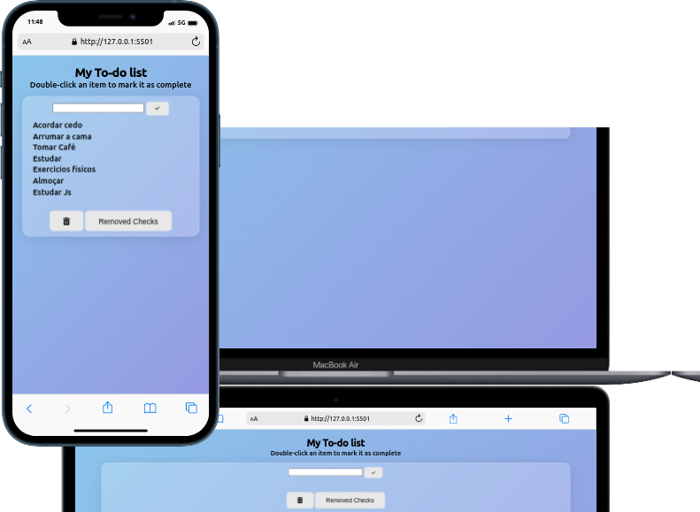

#  <h1 align="center">My To-do List!</h1>

## Projeto desenvolvido durante o bloco de fundamentos da Trybe

Desenvolvi uma lista de tarefas usando HTML, CSS e JavaScript.

## O que foi desenvolvido

Desenvolvemos um app de receitas, utilizando React: Redux e Hooks!

Na aplicação é possível ver, buscar, filtrar, favoritar e acompanhar o progresso de preparação de receitas e drinks!

A base de dados foram 2 APIs distintas, uma para comidas e outra para bebidas.

## Mobile First 

Mobile First é um conceito aplicado em projetos web onde o foco inicial da arquitetura e 

desenvolvimento é direcionado aos dispositivos móveis.

## 🛠 Tecnologias

As seguintes ferramentas foram usadas na construção do projeto:

- [Html](https://developer.mozilla.org/en-US/docs/Web/HTML)
- [Css](https://developer.mozilla.org/en-US/docs/Web/CSS)
- [Javascript](https://developer.mozilla.org/en-US/docs/Web/JavaScript)
- [Font-Awesome](https://fontawesome.com/)
